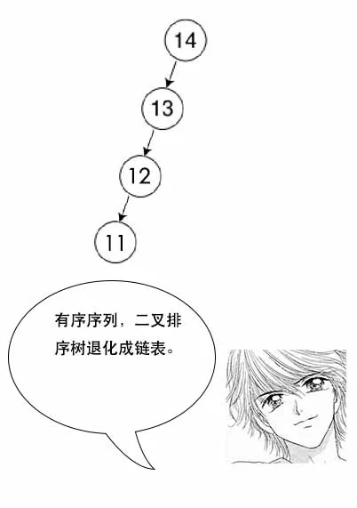
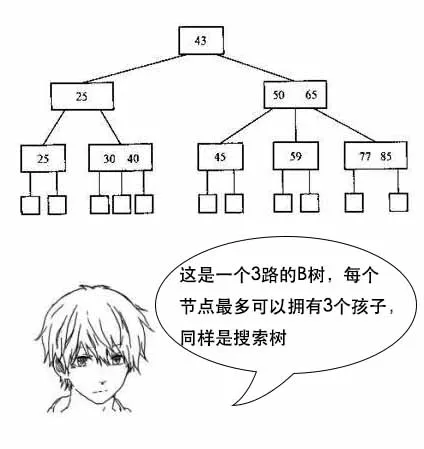

[TOC]

## 为什么MySQL数据库要用B+树存储索引？
### 发现系统中某个sql查询比较慢，会怎么办
为条件字段添加索引
### MySQL中存储索引用的是什么数据结构
B+树
### B+树的查询时间大概多少
与树的高度有关， log(n)
### 如果是hash存储索引，查询时间是多少
O(1)
### 既然hash比B+树更快，为什么MySQL还用B+树来存索引
如果只选一个数据，那确实是hash更快。但是数据库中经常会选择多条，这时候由于B+树索引有序，并且又有链表相连，它的查询效率比hash就快很多了。
而且数据库中的索引一般是在磁盘上，数据量大的情况可能无法一次装入内存，B+树的设计可以允许数据分批加载，同时树的高度较低，提高查找效率。

### 二叉排序树
左边节点比根节点小，右边比根节点大
并且左右子树都是二叉排序树

极端情况 -> 插入序列是有序的 -> 退化 -> 链表
<!--  -->

平衡在插入的时候同时调整这课树，让它节点尽可能均匀分布
### 红黑树能简单讲讲吗？
平衡树的一种 保证树的平衡性

树的查找性能取决于树的高度，让树尽可能平衡，就是为了降低树的高度

java TreeSet底层就是红黑树实现
### B树
B树是一种多路搜索树，它的每个节点可以拥有多于两个孩子节点。M路的B树最多能拥有M个孩子节点。

多路 -> 降低树的高度 -> 无限多路 -> 退化 有序数组

使用场景 文件系统的索引
文件系统和数据库的索引都存在硬盘上，并且如果数据量大的话，不能一次性加载到内存中。
每次加载B树的一个节点然后一步步往下找

### B+树
B+树是在B树的基础上进行改造的，它的数据都在叶子节点，同时叶子节点之间还加了指针形成链表

数据库中select数据，不一定只选一条，很多时候会选多条，比如按照id排序后选10条。

如果是多条的话，B树需要做局部的中序遍历，可能要跨层访问。而B+树由于所有数据都在叶子结点，不用跨层，同时由于有链表结构，只需要找到首尾，通过链表就能把所有数据取出来了。